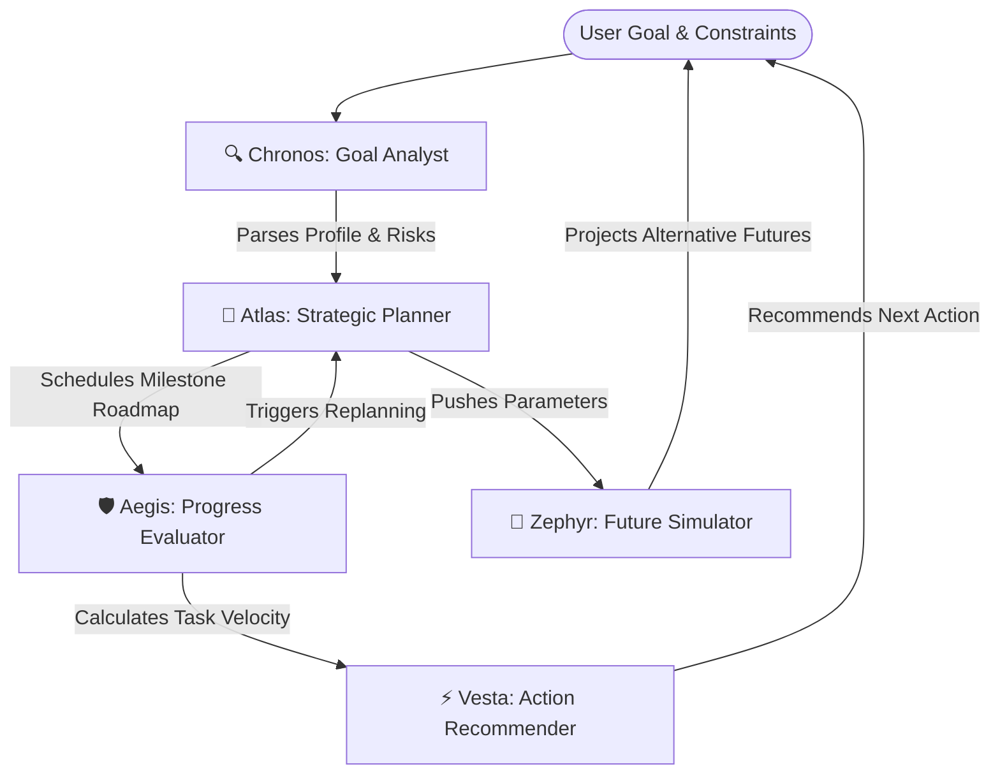

# Life Navigator AI

> **"Your Personal AI Strategist That Helps You Discover The Best Next Step Toward Your Future."**

---

## 🧭 Project Overview
**Life Navigator AI** is a production-ready personal guidance system built under the **Concierge Agents** track. 

Unlike standard chatbots or simple task managers, it is structured as a **Multi-Agent Orchestrator** that plans, reasons, adapts, and actively guides users. It creates adaptive roadmaps, tracks progress velocity, recommends the single highest-impact "next action" based on energy levels, and runs Monte Carlo-style simulations to project future outcomes under different time commitments.


---

## ⚠️ Problem Statement
Millions of individuals set long-term goals (learning full-stack development, launching a startup, training for a marathon) but struggle to sustain consistency because of:
* **Information Overload** – Not knowing the logical sequence of topics.
* **Decision Fatigue** – Overthinking what to study or practice daily.
* **Rigid Planning** – Abandoning plans completely when a deadline is missed.
* **Lack of Accountability** – No feedback loops tracking consistency.

---

## ⚡ Solution
Life Navigator AI acts as a personal strategist by combining five specialized agents that communicate on a shared event bus:

1. **Understands Goals & Constraints**: Asks discovery parameters (level, obstacles, hours).
2. **Generates Roadmaps**: Breaks large goals into milestones and weekly targets.
3. **Action Recommendation Engine**: Pinpoints the single best action to do *right now*.
4. **Adaptive Replanner**: Dynamically stretches timelines or reprioritizes tasks if deadlines are missed.
5. **Future Simulation**: Allows side-by-side scenario comparisons (e.g., 5 hrs/wk vs. 15 hrs/wk) to identify the optimal work-life balance.

---

## 🤖 Multi-Agent Architecture



* **Chronos (Goal Analysis Agent)**: Analyzes objectives, skill levels, target timelines, and risk factors.
* **Atlas (Strategic Planner)**: Generates the sequence of milestones and handles week-to-week workload scheduling.
* **Vesta (Action Recommender)**: Suggests a high-impact daily task adjusted for the user's energy level.
* **Aegis (Progress Evaluator)**: Monitors checklist completions and updates the velocity rating.
* **Zephyr (Future Simulator)**: Forecasts burnout curves, completion dates, and success probability.

---

## 💎 Core Features

### 1. Goal Discovery Wizard
Users input custom objectives or select pre-seeded templates (Indie SaaS Product, Full-Stack Developer, Marathon Runner, CFA Level 1 Exam). The system builds a detailed goal profile based on starting skill, obstacles, and weekly budget.

### 2. Next Best Action Engine
At any point, the user is presented with exactly **one** highest-priority action, estimated completion minutes, expected impact, and the underlying logical reasoning. The action scales into a *Micro-Habit Step* on low-energy days or a *Deep-Work Sprint* on high-energy days.

### 3. Adaptive Planning
If the user falls behind or simulates missed targets, the **Aegis** and **Atlas** agents execute a replanning routine. Rather than failing, the system automatically shifts pending targets or extends deadlines to keep the momentum alive.

### 4. Future Simulation Engine
Drag the weekly budget slider to compare alternative paths. The system calculates:
* **Completion Dates**: Forecasted duration.
* **Success Probability**: Abandonment risks from low momentum vs. burnout risks from over-commitment.
* **Progression Curves**: Interactive lines plotting theoretical vs. actual pacing.

### 5. Agent Nexus (Terminal & Directives)
Inspect the active logs of the inter-agent communication bus. Users can enter direct commands:
* `/burnout_mitigation` - Negotiates rest loops and caps hours.
* `/optimize_timeline` - Compresses milestone structures.
* `/scope_reduction` - Excises secondary modules to fit constraints.

---
🌐 **Live Demo**
https://lifenaviatoragent.netlify.app/

## 💻 Local Setup and Running

Since the application requires zero external packages (no npm or pip dependencies), it is lightweight and ready out of the box.

1. Ensure **Python 3** is installed.
2. Clone the repository files into a directory.
3. Open a terminal inside that directory and run:
   ```bash
   python server.py
   ```
4. Navigate to **[http://localhost:8000](http://localhost:8000)** in your browser.
